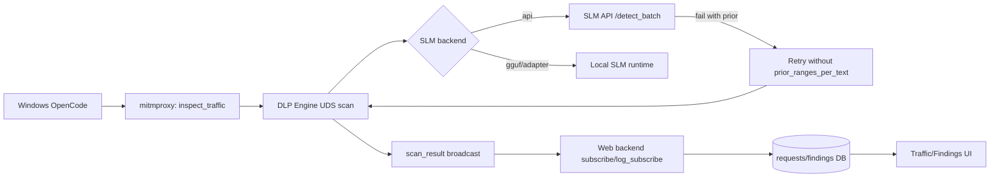

# [Patch Log] AI DLP Proxy 안정화: 이벤트 누락부터 sLM API 호환성까지

## TL;DR

| 항목 | Before | After |
|---|---|---|
| 엔진-웹 이벤트 연동 | 간헐적 누락 체감 | 구독 안정성 개선, 적재 연속성 향상 |
| sLM API 연동 | payload 조합별 500 편차 | fallback으로 운영 중단 리스크 완화 |
| 탐지 UI 분석성 | findings 상세 패널 회귀 | 행 클릭 상세 복구 |
| 분석 가시성 | 탐지값 중심 | 프롬프트 문맥(prompt excerpt)까지 노출 |

---

## 인시던트 타임라인

| 단계 | 관측된 현상 | 원인 | 조치 |
|---|---|---|---|
| 1 | "탐지는 되는데 웹에 안 보임" | subscribe/log_subscribe 불안정 구간 | 엔진 이벤트 경로 정리 + 클라이언트 타임아웃 보정 |
| 2 | "sLM이 호출되는지 불명확" | API 경로 성공/실패 신호 부족 | /health, /stats, 엔진 경유 scan 동시 검증 |
| 3 | detect_batch 간헐 500 | 다중 텍스트 + prior_ranges_per_text 호환성 편차 | prior 필드 생략/재시도 fallback 추가 |
| 4 | findings 상세 분석 불가 | 상세 패널 UI 회귀 | 행 클릭 상세 패널 복구 |

---

## 아키텍처 흐름 (패치 후)

---

## 패치 맵

| 레이어 | 변경 파일 | 핵심 변경 | 운영 효과 |
|---|---|---|---|
| 엔진 처리 | scripts/engine_server.py | scan-only 브로드캐스트, scan 오프로딩/직렬화 | 이벤트 루프 체감 정체 완화 |
| 트래픽 파싱 | scripts/inspect_traffic.py, src/engine/extractor.py | provider 판별/정책 가드 보강 | block/mask 판정 일관성 향상 |
| sLM 파이프라인 | src/engine/pipeline/slm_stage.py | prior 필드 조건부 전송 + fallback 재시도 | API 버전 편차 흡수 |
| 백엔드 저장/API | web/backend/db.py, web/backend/models.py, web/backend/routers/findings.py | prompt excerpt 저장/응답 포함 | 탐지 문맥 추적 가능 |
| 운영 API | web/backend/routers/pipeline.py, web/backend/routers/control.py | /slm/health, slm 설정 기본값 | 운영 상태 점검 단순화 |
| 웹 서빙 | web/backend/main.py | SPA fallback + /certs 정적 서빙 | 배포/접속 안정성 개선 |
| 프론트 UX | web/frontend/src/routes/traffic/+page.svelte, web/frontend/src/routes/findings/+page.svelte | 문맥 컬럼 + findings 상세 패널 복구 | 분석 동선 단축 |
| 운영 화면 | web/frontend/src/routes/settings/+page.svelte, web/frontend/src/routes/process/+page.svelte | SLM backend/url/health UI, start/stop 재조회 지연 | 상태 오판 감소 |

---

## 검증 체크리스트

- [x] 장시간 scan 이후 traffic 적재 확인
- [x] alert + applied_result 반영 시 DB 상태 일치 확인
- [x] sLM API /health /detect /detect_batch /stats 응답 확인
- [x] 500 재현 후 fallback 경로 정상화 확인
- [x] findings 행 클릭 상세 패널 동작 확인
- [x] 프론트 빌드 및 웹 재기동 후 이벤트 흐름 확인

---

## 외부 sLM 저장소 연계 작업 (qwen_tunning)

| 항목 | 반영 내용 |
|---|---|
| 관측성 | detect/detect_batch 상세 로그, 느린 요청 경고, 누적 통계 |
| 호환성 | detect_batch 500 관련 prior_ranges_per_text 처리 보정 |
| 성능 | 긴 입력 조기 종료(early stop), skip 통계 반영 |
| 품질 | placeholder/라벨 문자열 오탐 필터링 |

---

## 인사이트 3가지

1. 운영에서는 "탐지 품질"보다 "관측 품질"이 먼저 무너지면 신뢰가 붕괴한다.
2. API 계약은 성공 케이스보다 실패 시 안전한 축소 경로가 더 중요하다.
3. 회귀는 기능보다 UX에서 먼저 체감된다.

---

## 다음 스프린트

| 우선순위 | 계획 |
|---|---|
| P0 | 원격 sLM API 버전 정렬 (fallback 의존도 축소) |
| P1 | findings 상세/subscribe 안정성/sLM payload 회귀 테스트 자동화 |
| P2 | 운영 edge case를 학습/평가 셋에 반영하는 품질 폐루프 강화 |

---

## 5줄 공지 버전

- 이벤트 누락 체감의 핵심 원인을 엔진-웹 구독 경로에서 식별하고 안정화했습니다.
- 탐지 결과에 프롬프트 문맥을 연결해 분석 가능한 로그 형태로 확장했습니다.
- sLM API payload 호환성 편차는 fallback 재시도로 운영 리스크를 완화했습니다.
- findings 상세 패널 회귀를 복구해 분석 동선을 단축했습니다.
- 다음 단계는 sLM API 버전 정렬과 회귀 테스트 자동화입니다.
