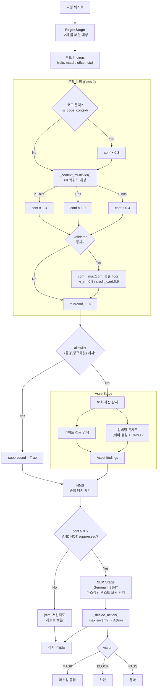
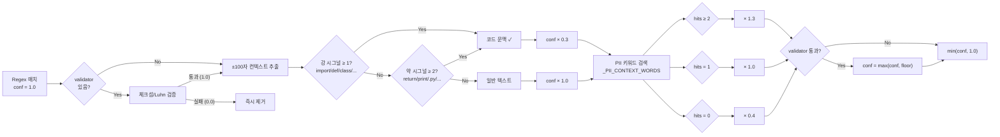
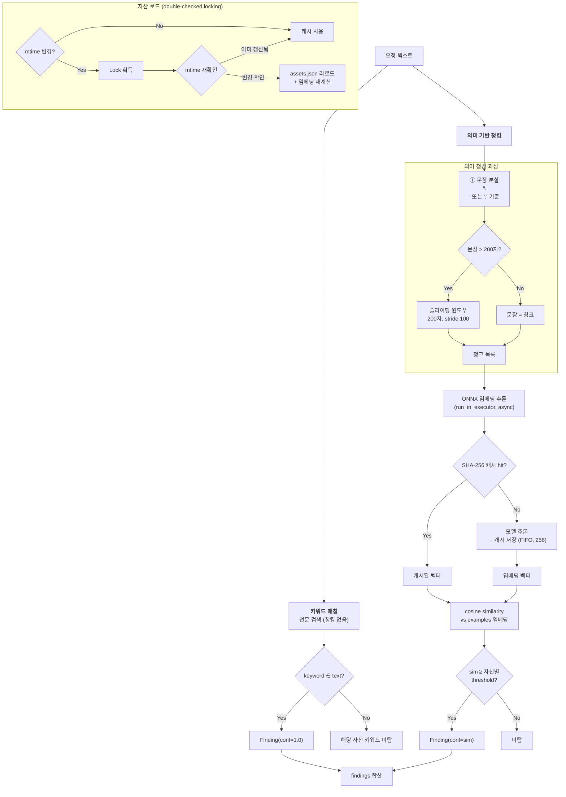
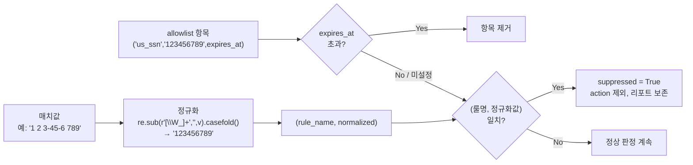
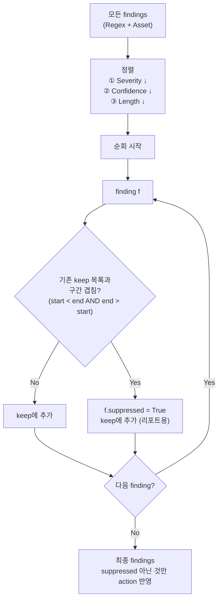

# Regex 오탐 감소 + 보호 자산 탐지 — 개선 계획서

> 작성일: 2026-04-06 · rev.10

RegexStage에 문맥 기반 신뢰도 보정을 추가하여 코드/주소 등의 오탐을 줄이고,
사용자 정의 보호 자산을 키워드+임베딩으로 탐지하는 신규 스테이지를 추가한다.
TUI에 탐지 횟수 컬럼을 추가하고 불필요한 패킷 큐를 제거한다.

---

## 1. 문제 분석 — 룰별 오탐 위험도

| 룰 | validator | 오탐 위험 | 대표 오탐 사례 |
|---|---|---|---|
| `kr_passport` | ❌ 없음 | **높음** | 변수명 `M12345678`, 제품코드 `AB1234567` |
| `api_key_assignment` | ❌ 없음 | **높음** | `secret_key = some_func()`, 설정 코드 할당문 |
| `us_ssn` | ❌ 없음 | 중간 | 코드 내 `123-45-6789` 형태 상수 |
| `kr_phone` | ❌ 없음 | 중간 | 코드 내 숫자열 |
| `jwt_token` | ❌ 없음 | 중간 | base64 인코딩된 비-JWT 데이터 |
| `kr_rrn` | ✅ 체크섬 | 낮음 | — |
| `credit_card` | ✅ Luhn | 낮음 | — |
| 나머지 6개 | ❌ | 낮음 | 패턴 자체가 고유함 |

### 핵심 원인

Regex는 **패턴만 보고 문맥을 무시**한다.
룰이 많아질수록 "어딘가엔 걸림" 확률이 올라감.

- `import hashlib; secret_key = hashlib.sha256(data)` → `api_key_assignment` 오탐
- 주소 `강남구 123-45` → 숫자 패턴 오탐
- `boto3.client('s3')` → 코드 내부 문자열 오탐
- `M12345678` (변수명) → `kr_passport` 오탐

---

## 2. 해결 아키텍처 — 2-Pass 검증

```
요청 텍스트
    │
    ▼
[Pass 1] Regex 후보 추출 (기존 — 높은 재현율, 오탐 허용)
    │
    ▼  candidates: [{rule, match, offset, context}]
    │
[Pass 2] 문맥 검증 (신규 — 오탐 필터링)
    ├── ① 코드 문맥 감지: 주변에 import/def/class 등 → confidence ↓↓
    ├── ② 주변 단어 분석: PII 관련 단어 있으면 confidence ↑
    └── ③ validator 하한 보장: 체크섬/Luhn 통과 시 conf ≥ 룰별 floor
           │
           ▼
    confidence threshold (0.5) 적용
           │
           ▼
    최종 findings (높은 정밀도)
```

---

## 2-1. 파이프라인 상세 흐름도

### 전체 파이프라인 (Phase 1 + 3 완료 후)



### Phase 1 — Regex 문맥 보정 상세 흐름



### Phase 3 — AssetStage 임베딩 흐름



### Allowlist 판정 흐름



### NMS (Non-Maximum Suppression) 흐름



---

## 3. Phase 1 — Regex 오탐 감소 (의존성 없음)

### Step 1. 코드 문맥 감지

**파일**: `src/ai_dlp_proxy/engine/pipeline/regex_stage.py`

`_is_code_context(context_before, context_after) → bool` 함수 추가.
매치 주변 텍스트(기존 ±100자 컨텍스트)에서 코드 시그널 탐색.

**강/약 시그널 분리** — 강시그널 1개만으로도 코드 문맥 판정.
**단어 경계(`\b`) 기반 정규표현식** 사용 — 단순 `in` 문자열 포함 검사는
자연어 문장("Please return this document")에서 오탐 유발:

```python
import re

# 강 시그널: 단어 경계 + lookahead/특수문자 매칭
# re.ASCII 필수 — 한글 조사가 붙은 경우("import를") \b가
# 유니코드 문자 경계로 인식되어 매칭 실패하는 문제 방지
_STRONG_CODE_RE = re.compile(
    r'\b(?:import|from|def|class|function)\b'
    r'|\brequire\s*\('
    r'|\bconsole\.'
    r'|#include\b',
    re.IGNORECASE | re.ASCII,
)
# 약 시그널: 단어 경계 + 연산자/구두점
_WEAK_CODE_RE = re.compile(
    r'\breturn\b'
    r'|\bprint\s*\('
    r'|\blog\s*\('
    r'|=>|->'
    r'|\(\)\s*\{'
    r'|\};'
    r'|://localhost'
    r'|\b0x[0-9a-f]'
    r'|\\x[0-9a-f]'
    r'|\bhashlib\b'
    r'|\bbase64\b'
    r'|\.py\b|\.js\b'
    r'|\b(?:var|const|let)\s',
    re.IGNORECASE | re.ASCII,
)

def _is_code_context(ctx_before: str, ctx_after: str) -> bool:
    window = ctx_before + ctx_after
    strong = len(_STRONG_CODE_RE.findall(window))
    weak   = len(_WEAK_CODE_RE.findall(window))
    return strong >= 1 or weak >= 2
```

> **`\b` + `re.ASCII` 근거**: `return` 단어가 자연어 문장 "Please return this"에서도
> 매칭되는 문제를 방지. `\breturn\b`는 독립 토큰으로만 매칭하지만,
> 이 단어 자체가 자연어에도 존재하므로 **약 시그널** 분류를 유지하고
> 2개 이상 동시 매칭 시에만 코드 문맥으로 판정.
> `re.ASCII` 적용으로 `\b`가 ASCII 단어 경계(`[a-zA-Z0-9_]`)만 인식하여
> 한글 조사가 붙은 "import를", "return은" 등에서도 정상 매칭.

코드 문맥이면 `confidence × 0.3` 적용.
단, **validator 통과 매치는 하한 보장** (Step 3 참조).

### Step 2. 주변 단어 신뢰도 보정

**파일**: `src/ai_dlp_proxy/engine/pipeline/regex_stage.py`

`_context_multiplier(rule_name, ctx_before, ctx_after) → float` 함수 추가.
룰별 PII 문맥 키워드 — **코드에도 등장하는 기술 단어 배제, 자연어/행위 단어 위주**:

```python
_PII_CONTEXT_WORDS = {
    "kr_rrn":             {"주민", "등록", "생년", "신분", "본인확인",
                           "resident", "identification", "birth"},
    "credit_card":        {"카드", "결제", "신용", "승인", "명세",
                           "card", "payment", "credit", "billing"},
    "kr_phone":           {"전화", "연락", "핸드폰", "모바일", "통화",
                           "phone", "mobile", "contact", "call"},
    "email":              {"메일", "연락처", "이메일", "보내기", "수신",
                           "mail", "inbox", "send", "recipient"},
    "kr_passport":        {"여권", "출국", "입국", "비자", "공항",
                           "passport", "departure", "visa", "airport"},
    "us_ssn":             {"사회보장", "세금", "납세", "social security",
                           "tax", "taxpayer"},
    "api_key_assignment": {"발급받은", "발급된", "외부", "연동", "서비스키",
                           "issued", "external", "integration"},
    "aws_access_key":     {"클라우드", "배포", "인프라", "계정",
                           "cloud", "deploy", "infra", "account"},
    "jwt_token":          {"로그인", "세션", "인가", "bearer",
                           "login", "session", "auth"},
    "github_pat":         {"커밋", "푸시", "리포", "깃허브",
                           "commit", "push", "repo", "github"},
    "pem_private_key":    {"인증서", "발급", "갱신", "ssl",
                           "certificate", "renew", "private key"},
    "kr_driver_license":  {"면허", "운전", "발급", "경찰",
                           "license", "driving", "police"},
}

def _context_multiplier(rule_name, ctx_before, ctx_after):
    keywords = _PII_CONTEXT_WORDS.get(rule_name)
    if keywords is None:
        return 0.7  # 미등록 룰: 중립보다 약간 낮은 기본값 (감사 로그 기록)
    window = (ctx_before + ctx_after).lower()
    hits = sum(1 for k in keywords if k in window)
    if hits >= 2: return 1.3
    if hits == 1: return 1.0
    return 0.4
```

> **PII 키워드는 `\b` 비적용**: 코드 시그널과 달리 PII 키워드("주민", "여권" 등)는
> 자연어 문맥에서만 등장하므로 단순 부분문자열 검색(`in`)이 적합.
> 한국어 단어는 공백 구분이 없어 `\b`가 예상대로 동작하지 않음.

보정 로직:
- `_PII_CONTEXT_WORDS`에 미등록 룰 → `0.7` 반환 (예외 방지, 중립보다 약간 낮은 기본값)
- 매치 주변 텍스트에서 해당 룰의 키워드 hit 수 계산
- 2개 이상 → `× 1.3` (확실한 PII 문맥)
- 1개 → `× 1.0` (중립)
- 0개 → `× 0.4` (PII 관련 단어 없음 → 의심, 고위험 룰 단독 매치 오탐 방지)

### Step 3. `scan()` confidence 흐름 수정

**파일**: `src/ai_dlp_proxy/engine/pipeline/regex_stage.py`

현재:
```python
conf = validator(m.group()) if rule.validator else 1.0
if conf <= 0.0: continue
# → Finding(confidence=conf)
```

변경:
```python
has_validator = rule.validator is not None
conf = rule.validator(m.group()) if has_validator else 1.0
if conf <= 0.0: continue              # 체크섬/Luhn 실패 → 즉시 제거
# 컨텍스트 추출 후 — 코드 패널티 먼저, 부스트 나중 (순서 중요)
if _is_code_context(ctx_before, ctx_after):
    conf *= 0.3                       # 코드 문맥 패널티 먼저 적용
conf *= _context_multiplier(rule.name, ctx_before, ctx_after)  # 문맥 배율 적용
# validator 통과 매치는 룰별 동적 하한 보장
floor = _VALIDATOR_FLOOR.get(rule.name, 0.6)
if has_validator and conf < floor:
    conf = floor
conf = min(conf, 1.0)
# → Finding(confidence=conf)
```

**룰별 validator_floor** — 체크섬 신뢰도에 따른 차등 하한:
```python
_VALIDATOR_FLOOR = {
    "kr_rrn":      0.8,   # 체크섬 통과 시 거의 확실한 실데이터
    "credit_card": 0.6,   # Luhn 알고리즘은 우연 일치 확률 존재
}
# 미등록 validator 룰 기본 floor: 0.6
```

**연산 순서 근거**: 코드 패널티(×0.3)를 먼저 적용한 뒤 부스트를 곱해야
부스트 키워드가 코드 문맥 안에 있을 때 패널티를 부분 상쇄하는 자연스러운 동작이 됨.
반대 순서(부스트 먼저)면 부스트로 올라간 값에 패널티가 곱해져 최종값 예측이 어려움.

**연산 예시**:
| 상황 | 코드 패널티 | 배율 | validator | 최종 conf |
|---|---|---|---|---|
| 일반 텍스트 + PII 키워드 2개 | ×1.0 | ×1.3 | 없음 | 1.0 (capped) |
| 코드 문맥 + PII 키워드 0개 | ×0.3 | ×0.4 | 없음 | 0.12 |
| 코드 문맥 + PII 키워드 2개 | ×0.3 | ×1.3 | 없음 | 0.39 |
| 코드 문맥 + kr_rrn 체크섬 통과 | ×0.3 | ×0.4 | 하한 0.8 | **0.8** |
| 일반 텍스트 + kr_rrn 체크섬 통과 | ×1.0 | ×0.4 | 하한 0.8 | **0.8** |
| 일반 텍스트 + kr_rrn + PII 키워드 1개 | ×1.0 | ×1.0 | 하한 0.8 | 1.0 |
| 코드 문맥 + credit_card Luhn 통과 | ×0.3 | ×0.4 | 하한 0.6 | **0.6** |
| 일반 텍스트 + 키워드 0개 (kr_passport) | ×1.0 | ×0.4 | 없음 | **0.4** → threshold 미만 |
| 일반 텍스트 + 미등록 룰 | ×1.0 | ×0.7 | 없음 | 0.7 |

- **Validator 통과 시 룰별 동적 하한**: `kr_rrn`(0.8) > `credit_card`(0.6) > 기타(0.6)
  체크섬 신뢰도 차이 반영 — kr_rrn 체크섬은 우연 일치 확률 극히 낮으므로 높은 floor,
  Luhn은 우연 일치 가능성 있으므로 낮은 floor
- 기존 validator 이진 판정(0.0/1.0)은 그대로 유지
- Validator 없는 룰의 코드 문맥 + 키워드 0개 최소 confidence: `1.0 × 0.3 × 0.4 = 0.12`
- Validator 없는 일반 텍스트 + 키워드 0개: `1.0 × 1.0 × 0.4 = 0.4` → **threshold(0.5) 미만으로 자동 필터링**

### Step 4. confidence threshold 도입 + 롤백 플래그

**파일**: `src/ai_dlp_proxy/engine/pipeline/__init__.py`

`_decide_action()` 수정:
```python
def _decide_action(findings: list[Finding], threshold: float = 0.5) -> Action:
    # 단일 필터 지점: suppressed + confidence 동시 체크 → 누출 방지
    effective = [
        f for f in findings
        if f.confidence >= threshold and not f.suppressed
    ]
    if not effective:
        return Action.PASS
    max_sev = max(f.severity.value for f in effective)
    ...
```

> **경계값 정의**: `>= threshold` (이상). conf = 0.5인 finding은 threshold 0.5에서 action 포함.
> **단일 필터 지점**: suppressed 체크와 confidence 체크를 한 곳에서 수행하여
> 어느 한쪽을 빠뜨려도 누출되지 않도록 보장.

**제어 파일 추가 키**:
```json
{
    "confidence_threshold": 0.5,
    "context_penalty_enabled": true
}
```

- `confidence < threshold` 인 finding은 **action 결정에서 제외**
- 모든 finding은 결과에 포함 (낮은 confidence도 리포트에 남겨 투명성 확보)
- `context_penalty_enabled: false` 설정 시 코드 문맥/부스트 보정 전체 비활성 → 즉시 이전 동작 복원
- threshold 기본값 `0.5`, TUI에서 조절 가능

### Step 4b. 값 수준 허용 목록 (Allowlist)

**파일**: `src/ai_dlp_proxy/engine/pipeline/regex_stage.py`

룰 전체를 끄지 않고 **특정 매치 값만 무시**할 수 있는 allowlist:

```json
{
    "allowlist": ["123-45-6789", "test@example.com"]
}
```

- `scan()`에서 매치 텍스트가 allowlist에 포함되면 **finding은 생성하되 `suppressed=True` 플래그 부여**
- suppressed finding은 action 결정에서 제외하지만 리포트에 남김 → 감사(audit) 가능
- 제어 파일(`dlp-control.json`)에 `allowlist: []` 키 추가
- 용도: 테스트용 더미 SSN, 사내 테스트 이메일 등 반복 오탐 제거
- TUI에서 행 우클릭/롱프레스 → "이 값 허용" 추가 (Phase 2에서 구현)

**보안 보호책**:
- allowlist 항목 수 상한: **최대 100개** (초과 시 가장 오래된 항목 자동 제거)
- allowlist 변경 시 감사 로그 기록: `_lg(f"[yellow][allowlist] 추가: {value!r}[/]")` + 파일 로그
- suppressed finding도 결과에 포함되어 사후 감사 가능
- `Finding` dataclass에 `suppressed: bool = False` 필드 추가 (base.py)

**가혹한 정규화(Aggressive Normalization) 기반 비교**:

단순 대소문자 정규화만으로는 공백/특수문자 삽입으로 우회 가능.
예: `"1 2 3-4 5-6 7 8 9"` → allowlist의 `"123-45-6789"`와 불일치 → 누출.

```python
import re

def _normalize_for_allowlist(value: str) -> str:
    """allowlist 비교용: 비영숫자 전체 제거 + 소문자 변환.
    '1 2 3-45-6789' → '123456789'
    'Test@Example.com' → 'testexamplecom'
    """
    return re.sub(r'[\W_]+', '', value).casefold()
```

- **모든 룰 동일 정규화**: 비영숫자(공백, 하이픔, 점, @, 쉼표 등) 전체 제거 후 순수 영숫자 형태로 비교
- 한글 단어는 `\W`에 해당하지 않아 유니코드 문자 보존됨
- **충돌 방지**: `(룰명, 정규화값)` 쌍으로 비교 — 서로 다른 데이터가 동일 정규화값을
  갖는 충돌 방지 (예: `"12-345"`와 `"1-2345"` → 둘 다 `"12345"` 되지만 룰이 다르면 독립)
- allowlist 저장 형식: `{"rule": "us_ssn", "value": "123-45-6789", "normalized": "123456789", "added_at": "2026-04-06T12:00:00"}`
- **TTL(만료 시간)**: 항목별 `expires_at` 필드 (선택). 설정 시 해당 시각 이후 자동 제거.
  미설정 시 영구. TUI에서 추가 시 "1시간/1일/영구" 선택 → 임시 테스트 데이터 영구 허용 방지
- `scan()`에서 매치값을 `(rule.name, _normalize_for_allowlist(match_text))` 쌍으로 비교

---

## 4. Phase 2 — TUI 개선

### Step 5. 마스킹 규칙 테이블에 탐지 횟수 컬럼

**파일**: `scripts/tui.py`

- `on_mount`: `mt.add_column("탐지", key="hits", width=6)` 추가
- `_mask_rule_hits: dict[str, int] = {}` 카운터
- `_aft()` 호출 시 rule 카운트 증가 → `_refresh_mask_table()`에서 반영
- `_mask_rule_row()`에 hits 파라미터: `f"[cyan]{hits}[/]"`

### Step 6. 실시간 패킷 큐 제거

**파일**: `scripts/tui.py`

삭제 대상:
- compose: `📡 실시간 패킷 결정 이력` 카드 전체
- 위젯: `#ctrl-qtable`, `#ctrl-qdetail`, `#ctrl-queue-split`
- 메서드: `_ctrl_add_packet()`, `_sel_ctrl_packet()`
- 데이터: `_ctrl_queue_rows`
- CSS: `#ctrl-queue-split`, `#ctrl-queue-left`, `#ctrl-qtable`
- `_one()`에서 `self._ctrl_add_packet(ev)` 호출 제거

**감사 로그 대체**: TUI 패킷 이력 제거 후에도 보안 감사 요구사항 충족을 위해
**파일 기반 감사 로그 유지** (`audit.jsonl`):
- `_one()`에서 탐지 이벤트를 `~/.config/ai-dlp-proxy/audit.jsonl`에 append
- 형식: `{"ts": "...", "action": "MASK", "findings": [...], "request_hash": "..."}`
- 로테이션: 10MB 초과 시 `.1` 백업 후 신규 생성
- TUI 제거와 독립적으로 항상 기록

### Step 6b. 저신뢰도 finding 표시

**파일**: `scripts/tui.py`

- 탐지 상세 패널(`#fdetail`)에서 confidence < threshold finding을 `[dim]` 스타일로 표시
- 신뢰도 컬럼: `conf < 0.5` → `[dim]{conf:.1f}[/]`, `conf >= 0.5` → `[bold]{conf:.1f}[/]`
- 엔진 로그(`_log_ev`)에도 `[dim]` 접두어 추가: `[low-conf]` 태그

---

## 5. Phase 3 — 보호 자산 탐지 (AssetStage)

### Step 7. 자산 데이터 스키마

**파일**: `~/.config/ai-dlp-proxy/assets.json` (영구 저장, 재부팅 안전)

```json
{
  "assets": [
    {
      "id": "a1",
      "name": "SSH 키",
      "severity": "critical",
      "keywords": [".ssh", "id_rsa", "id_ed25519", "authorized_keys"],
      "description": "SSH 개인키 및 관련 파일",
      "examples": [
        "id_rsa 파일을 첨부합니다",
        "SSH 키를 같이 보내드립니다",
        ".ssh/authorized_keys 수정해주세요"
      ],
      "embedding_threshold": 0.85
    },
    {
      "id": "a2",
      "name": "프로젝트 피닉스",
      "severity": "high",
      "keywords": ["project-phoenix", "피닉스", "phoenix"],
      "description": "내부 기밀 프로젝트 관련 내용",
      "examples": [
        "피닉스 프로젝트 진행 상황 공유드립니다",
        "project-phoenix 최신 소스코드 입니다"
      ],
      "embedding_threshold": 0.80
    }
  ]
}
```

- `examples` 필드: 임베딩 비교 대상 (description 대신 대표 문장 사용 → 길이 왜곡 방지)
- `embedding_threshold` 필드: 자산별 유사도 임계값 (생략 시 기본 `0.80`)
- `~/.config/ai-dlp-proxy/` 경로: OS 재부팅 후에도 보존

### Step 8. AssetStage 구현

**파일**: `src/ai_dlp_proxy/engine/pipeline/asset_stage.py` (신규)

```
AssetStage(Stage)
├── name = "asset"
├── _lock = threading.Lock()  ← TOCTOU 경쟁 조건 방지
├── _load_assets()     ← mtime 캐시 + Lock, 변경 시만 리로드
├── _keyword_match()   ← 텍스트에 keyword 포함 → Finding (conf=1.0)
└── _embedding_match() ← 슬라이딩 윈도우 청크 임베딩 유사도 → Finding
```

- **키워드 매칭**: 항상 동작 (의존성 없음)
- **키워드 매칭 범위**: 텍스트 **전문 검색** (청킹 없음) — 키워드가 청크 경계에 걸리는 미탐 방지
- **임베딩 유사도**: `sentence-transformers` 설치 시 활성화
  - 모델 우선순위:
    1. `jhgan/ko-sroberta-multitask` (한국어 특화, 성능 우수)
    2. `BM-K/KoSimCSE-roberta` (한국어 특화, 경량)
    3. `all-MiniLM-L6-v2` (80MB, 범용 fallback — 한국어 성능 제한적)
  - 비교 대상: `examples` 필드의 대표 문장 임베딩 (description 아님)
  - 요청 텍스트 청킹: **의미 기반 청킹(Semantic Chunking)** 적용
    1. **1차 문장 분할**: `\n` 또는 `.`(마침표) 기준으로 텍스트 분리
    2. **단일 문장 > 200자**: 해당 문장에만 200자 슬라이딩 윈도우(stride 100) 적용
    3. **전체 텍스트 < 200자**: 전체를 단일 청크로 사용 (패딩/빈 청크 없음)
  - **고정 글자 수 청킹 제거 근거**: 200자 고정 슬라이딩 윈도우는 단어/문장
    중간을 절단하여 `ko-sroberta` 등 언어 모델의 임베딩 품질 저하 유발
  - 유사도 임계값: 자산별 개별 설정 가능 (`embedding_threshold` 필드, 기본 `0.80`)
  - 미설치 시 graceful fallback (키워드만, 경고 로그 1회)
  - **오프라인/에어갭 환경**: 모델 다운로드 실패(`ConnectionError`, `OSError`) 시
    자동으로 키워드 전용 모드 전환 + 경고 로그. `TRANSFORMERS_OFFLINE=1` 환경변수 지원
- **모델 로딩 + 워밍업**: 프록시 시작(Init) 시 모델 강제 로드 완료.
  `AssetStage.__init__()`에서 **더미 텍스트로 1회 추론** 수행 → 라이브러리 JIT 컴파일,
  모델 가중치 메모리 적재, ONNX 세션 초기화를 모두 완료하여 첫 요청 지연 방지.
  ```python
  # __init__ 마지막에
  if self._model:
      self._model.encode("warmup")  # 콜드 스타트 방지
  ```
- **ONNX 런타임 최적화** (CPU 환경 성능 보장):
  - PyTorch 원본 모델 대신 **ONNX 포맷** 변환 모델 우선 사용
  - `optimum[onnxruntime]` 설치 시 `ORTModelForFeatureExtraction` 로 자동 전환
  - 미설치 시 PyTorch fallback (기존 `sentence-transformers`)
  - CPU 추론 속도: PyTorch ~30ms/청크 → ONNX ~8–12ms/청크 (예상)
- **비동기 추론 경로** (프록시 스레드 블로킹 방지):
  - 임베딩 계산을 `asyncio.get_event_loop().run_in_executor(None, ...)`로
    스레드풀에 위임 → 프록시 이벤트 루프 비차단 유지
  - 복수 패킷 동시 유입 시 다른 요청 처리가 임베딩 계산 대기에 차단되지 않음
  - 타임아웃: `asset_embedding_timeout_ms: 500` (제어 파일), 초과 시 키워드만으로 fallback
- **스레드 안전성**: double-checked locking 패턴 적용:
  ```python
  # _cached_mtime = None 으로 초기화 → 첫 호출 시 항상 로드
  def _load_assets(self):
      if not os.path.exists(ASSETS_PATH):
          self._assets = []              # 파일 없음 → 빈 목록 (첫 실행 안전)
          return
      mtime = os.path.getmtime(ASSETS_PATH)
      if self._cached_mtime is not None and mtime == self._cached_mtime:
          return                          # Lock 밖 빠른 체크
      with self._lock:
          if self._cached_mtime is not None and mtime == self._cached_mtime:
              return                      # Lock 안 재확인
          # 실제 리로드 + 임베딩 재계산
          self._cached_mtime = mtime
  ```
- **임베딩 캐시**: SHA-256 해시 기반 메모이제이션 (maxsize=256).
  캐시 키를 입력 전문이 아닌 `hashlib.sha256(text.encode()).hexdigest()`로 설정하여
  긴 텍스트에 의한 메모리 점유 방지. 동일 프롬프트 재시도 시(프록시 환경에서 빈번) 임베딩 재계산 방지.
  ```python
  _embed_cache: dict[str, np.ndarray] = {}  # key = sha256 hex
  def _cached_embed(self, text: str) -> np.ndarray:
      h = hashlib.sha256(text.encode()).hexdigest()
      if h not in self._embed_cache:
          if len(self._embed_cache) >= 256:
              self._embed_cache.pop(next(iter(self._embed_cache)))  # FIFO 제거
          self._embed_cache[h] = self._model.encode(text)
      return self._embed_cache[h]
  ```
- Finding: `stage="asset"`, `rule=자산name`, `severity=자산severity`, `confidence=유사도`

### Step 9. 파이프라인 연결

**파일**: `src/ai_dlp_proxy/engine/pipeline/__init__.py`

- `_asset_stage = AssetStage()` 싱글톤
- 실행 순서: Regex → **Asset** → SLM
  - Asset을 SLM 전에 두는 이유: Asset finding을 SLM 마스킹 텍스트에 반영하여
    이미 자산으로 탐지된 키워드는 SLM이 중복 스캔하지 않도록 최적화
  - Asset과 SLM이 독립적인 경우 병렬 실행 가능 (향후 `asyncio.gather` 적용 검토)
- 제어 파일에 `asset_enabled: true/false` 키 추가

**SLM 단계 상호작용 명세**:
- SLM Stage(Gemma 4 2B-IT)는 Regex+Asset이 마스킹한 텍스트를 받아
  문맥 의존적 PII(이름, 주소 등)를 보완 탐지
- `_mask_text_for_slm()` 함수가 Regex+Asset findings의 매치 영역을
  `[치환 텍스트]`로 교체 → SLM에 전달
- Asset finding 마스킹 범위:
  - **키워드 매치**: 매치된 키워드 위치만 `[보호자산]`으로 교체 (정확한 span)
  - **임베딩 매치**: 청크 전체를 마스킹하면 과도한 제거 → **매칭된 청크 내에서
    자산 `keywords`가 출현하는 위치만 `[보호자산]`으로 교체**. 키워드 없는
    임베딩 전용 매치는 마스킹하지 않음 (SLM에게 문맥 보존)
- SLM은 마스킹되지 않은 나머지 텍스트만 스캔 → 중복 탐지 방지

### Step 9b. 중첩 탐지 제거 (Non-Maximum Suppression)

**파일**: `src/ai_dlp_proxy/engine/pipeline/__init__.py`

Regex와 Asset이 동일 텍스트 구간을 서로 다른 룰로 탐지할 경우,
리포트가 지저분해지고 마스킹 충돌이 발생할 수 있음.

```python
def _suppress_overlapping(findings: list[Finding]) -> list[Finding]:
    """IoU > 0 인 finding 쌍에서 우선순위 낮은 쪽 제거.
    우선순위: Severity(높을수록) > Confidence(높을수록) > Length(길수록)
    """
    findings.sort(key=lambda f: (-f.severity.value, -f.confidence, -(f.end - f.start)))
    keep = []
    for f in findings:
        if any(_overlaps(f, k) for k in keep):
            f.suppressed = True   # 제거되지마
            keep.append(f)        # 리포트에는 유지 (suppressed 플래그)
        else:
            keep.append(f)
    return keep

def _overlaps(a: Finding, b: Finding) -> bool:
    return a.start < b.end and b.start < a.end
```

- `_decide_action()` 호출 전에 `_suppress_overlapping()` 실행
- 제거된 finding도 `suppressed=True`로 리포트에 남김 (투명성)
- `Finding` dataclass에 `start: int`, `end: int` 필드 필요 (기존 `offset` + `len(match)` 활용)

### Step 10. TUI 보호 자산 관리 UI

**파일**: `scripts/tui.py`

- 제어 탭에 `🛡️ 보호 자산` 카드 (마스킹 규칙 아래)
- DataTable: 이름 / 키워드 / 심각도
- 추가 버튼 → Input 팝업 (이름, 키워드, 심각도)
- 행 클릭 → 삭제 확인
- `~/.config/ai-dlp-proxy/assets.json` 읽기/쓰기

---

## 6. 수정 파일 요약

| 파일 | Phase | 변경 내용 |
|---|---|---|
| `src/ai_dlp_proxy/engine/pipeline/regex_stage.py` | 1 | `_is_code_context()`, `_context_multiplier()`, validator 하한, allowlist, `scan()` 보정 |
| `src/ai_dlp_proxy/engine/pipeline/__init__.py` | 1, 3 | confidence threshold, 롤백 플래그, AssetStage 연결, NMS |
| `src/ai_dlp_proxy/engine/pipeline/base.py` | 1 | `Finding`에 `suppressed: bool = False` 필드 추가 |
| `src/ai_dlp_proxy/engine/pipeline/asset_stage.py` | 3 | **신규** — 보호 자산 키워드+임베딩 (스레드 안전) |
| `scripts/tui.py` | 2, 3 | 탐지 횟수, 패킷 큐 제거, 저신뢰도 표시, 보호 자산 UI |
| `~/.config/ai-dlp-proxy/assets.json` | 3 | **신규** — 보호 자산 정의 (영구 저장) |

---

## 7. 검증 계획

**방법**: `tests/` 디렉토리에 pytest 단위 테스트 추가. V6은 `test_cases.csv` 기반 자동화.
CI 파이프라인에서 회귀 방지를 위해 모든 테스트 자동 실행.

| # | 테스트 | 기대 결과 | 유형 |
|---|---|---|---|
| V1 | `"import hashlib\nsecret_key = hashlib.sha256(data)"` | `api_key_assignment` conf < 0.5, action 제외 | 단위 |
| V2 | `"제 전화번호는 010-1234-5678입니다"` | `kr_phone` conf ≥ 1.0 | 단위 |
| V3 | `"M12345678"` 단독 | `kr_passport` conf = 0.4 (키워드 0개 → ×0.4), `< 0.5` 이므로 action **제외** | 단위 |
| V4 | `"def parse(m12345678): return m"` | `kr_passport` conf = 0.12 (코드+키워드 0개) | 단위 |
| V5 | `"id_rsa 파일을 첨부합니다"` | asset finding `SSH 키` 생성 | 단위 |
| V6 | `test_cases.csv` 전부 | 기존 테스트 통과 (validator 룰 conf ≥ 룰별 floor 보장) | 자동화 |
| V7 | TUI 마스킹 규칙 테이블 | 탐지 컬럼 카운트 실시간 증가 | 수동 |
| V8 | `"880515-1104333"` 코드 문맥 안에서 | `kr_rrn` conf = 0.8 (validator floor 0.8), action 포함 | 단위 |
| V9 | `context_penalty_enabled: false` 설정 | 모든 보정 비활성, conf = 1.0 (이전 동작) | 단위 |
| V10 | allowlist에 `"123-45-6789"` 추가 | `us_ssn` 해당 값 매치 `suppressed=True`, action 제외 | 단위 |
| V11 | `"개인키 파일을 공유드립니다"` (키워드 없음) | `SSH 키` 자산 임베딩 매치 (`sentence-transformers` 설치 시) | 단위 |
| V12 | `_context_multiplier("unknown_rule", ...)` | 예외 없이 `0.7` 반환 (미등록 룰 fallback) | 단위 |
| V13 | `"Please return this document 010-1234-5678"` | `return` 약 시그널 1개만 매칭 → 기준 미달(≥2) → 코드 문맥 비활성화 | 단위 |
| V14 | allowlist `"123-45-6789"` vs 입력 `"1 2 3-45-6 789"` | 정규화 후 동일 → `suppressed=True` | 단위 |
| V15 | 의미 청킹: `"피닉스 프로젝트 진행 상황. 추가 보고."` | 문장 단위 청킹으로 2개 청크 생성, 절단 없음 | 단위 |
| V16 | Regex+Asset 동일 구간 탐지 | NMS로 높은 Severity 우선, 나머지 `suppressed=True` | 단위 |
| V17 | kr_rrn 체크섬 통과 + 코드 문맥 | conf = **0.8** (validator floor 0.8 적용) | 단위 |
| V18 | allowlist `("us_ssn", "12345")` vs `("kr_phone", "12345")` | 룰명 다르므로 독립 처리 | 단위 |

---

## 8. 결정 사항

- `sentence-transformers` 미설치 시 키워드 매칭만 동작 (Phase 3 점진 적용)
- confidence threshold 기본값 `0.5` — TUI에서 조절 가능
- `context_penalty_enabled` 플래그로 Phase 1 전체 보정 즉시 롤백 가능
- **Validator 통과 매치는 룰별 동적 floor**: `kr_rrn` 0.8, `credit_card` 0.6, 기타 0.6
  — 체크섬 좈류별 신뢰도 차등 반영
- **`api_key_assignment` 부스트 키워드**: 코드 빈출어(`api`, `secret`, `token`) 제거,
  자연어 행위 단어(`발급받은`, `연동`, `서비스키`)로 대체
- **자산 파일 경로**: `/tmp/` → `~/.config/ai-dlp-proxy/` (재부팅 안전)
- **임베딩 비교 대상**: description 아님 → `examples` 대표 문장 임베딩 (길이 왜곡 방지)
- **의미 기반 청킹**: 문장/개행 단위 1차 분할 → 200자 초과 문장만 슬라이딩 윈도우
- **임베딩 유사도 임계값**: 자산별 개별 설정 (`embedding_threshold`, 기본 `0.80`, 보수적 시작)
- **임계값 미세조정 가이드**: TUI 보호 자산 카드에서 탐지 결과(매치 문장 + 유사도 점수)
  확인 후 자산별 임계값 상/하향. 초기 `0.80`에서 미탐 발생 시 `0.70`까지 점진 하향 권장
- **SLM 모델**: `Gemma 4 2B-IT` (Google) — Qwen2.5-1.5B 대비 다국어 성능 우수, 파라미터 수 유사(2B).
  GGUF 파일명: `gemma-4-2b-it-q4_k_m.gguf`. 채팅 템플릿(`<start_of_turn>user\n...`)은
  GGUF 메타데이터에서 자동 로드 → `slm_stage.py` 코드 변경 최소 (모델 경로만 수정).
  GBNF grammar은 llama.cpp 레벨 기능이므로 모델 무관하게 동작.
- **임베딩 모델 우선순위**: 한국어 특화(`ko-sroberta`) → 범용(`MiniLM`) fallback
- **스레드 안전성**: `_load_assets()`에 double-checked locking 패턴 적용
- **값 수준 allowlist**: suppressed 플래그 + 감사 로그 + 상한 100개 + 가혹 정규화 + (룰명,값) 쌍 비교 + TTL
- **함수 네이밍**: `_context_boost` → `_context_multiplier` (감점도 수행하므로 "배율"이 정확)
- **미등록 룰 안전장치**: `_context_multiplier()`에서 `_PII_CONTEXT_WORDS`에 없는 룰은 `0.7` 반환
- **다국어 정책**: `_PII_CONTEXT_WORDS`에 한국어+영어 키워드 병기.
  혼용 환경(영어 코드 + 한글 주민등록번호 등)에서도 부스트 동작하도록
  각 룰에 영어 키워드도 포함. 예: `kr_rrn: {"주민", "등록", "resident", "identification"}`
- **키워드 매칭은 전문 검색** (청킹 없음), 임베딩 비교에만 슬라이딩 윈도우 적용
- **200자 미만 텍스트**: 슬라이딩 윈도우 없이 전체를 단일 청크로 처리
- **임베딩 오프라인 fallback**: 모델 다운로드 실패 시 키워드 전용 모드 자동 전환
- **ONNX 런타임**: CPU 환경에서 `onnxruntime` 우선 사용, 미설치 시 PyTorch fallback
- **비동기 추론**: `run_in_executor` 로 임베딩 계산 위임 → 프록시 스레드 블로킹 방지
- **임베딩 캐시**: SHA-256 해시 키 기반 메모이제이션 (maxsize=256, 메모리 효율)
- **감사 로그**: 패킷 큐 TUI 제거 후에도 `audit.jsonl` 파일 기반 기록 유지
- **Allowlist 가혹 정규화**: 비영숫자 전체 제거 후 비교 → 공백/특수문자 삽입 우회 방지
- **코드 시그널 단어 경계**: `_is_code_context`에 `\b` + `re.ASCII` 적용 → 한글 조사 붙어도 매칭
- **`_decide_action` 단일 필터**: suppressed + confidence를 한 곳에서 체크 (누출 방지)
- **중첩 탐지 NMS**: (Severity > Confidence > Length) 우선순위로 동일 구간 중복 제거
- Phase 1~2는 외부 의존성 없이 즉시 구현
- Phase 3은 환경(디스크/GPU) 확인 후 진행

---

## 9. 구현 순서

```
Phase 1 (즉시)
  Step 1 (강/약 시그널 코드 감지)
  → Step 2 (자연어 부스트 키워드)
  → Step 3 (scan 보정 + 룰별 동적 validator floor)
  → Step 4 (threshold + 롤백 플래그)
  → Step 4b (allowlist + 룰명 쌍 비교 + TTL)
  → 검증(V1~V4, V6, V8~V10, V12~V14, V17~V18)

Phase 2 (즉시)
  Step 5 (탐지 횟수 컬럼)
  → Step 6 (패킷 큐 제거)
  → Step 6b (저신뢰도 표시)
  → 검증(V7)

Phase 3 (환경 확인 후)
  Step 7 (자산 스키마)
  → Step 8 (AssetStage + Lock)
  → Step 9 (파이프라인 연결)
  → Step 9b (중첩 탐지 NMS)
  → Step 10 (TUI 자산 관리)
  → 검증(V5, V11, V15~V16)
```

---

## 10. ASCII 도식

### 10-1. 전체 파이프라인

```
┌─────────────────────────────────────────────────────────────────┐
│                         요청 텍스트                              │
└───────────────────────────────┬─────────────────────────────────┘
                                │
                                ▼
              ┌─────────────────────────────────┐
              │          RegexStage             │
              │  12개 룰 패턴 매칭 (고재현율)    │
              └─────────────────┬───────────────┘
                                │ 후보 findings
                                │ {rule, match, offset, ctx}
                                ▼
        ╔═══════════════════════════════════════════╗
        ║           Pass 2 — 문맥 보정              ║
        ║                                           ║
        ║  ┌──────────────────────────────────┐     ║
        ║  │  ① 코드 문맥 감지                │     ║
        ║  │     _is_code_context()           │     ║
        ║  │     강시그널(import/def) ≥ 1     │     ║
        ║  │     OR 약시그널(return/.py) ≥ 2  │     ║
        ║  │     → conf × 0.3                 │     ║
        ║  └──────────────────────────────────┘     ║
        ║                  ↓                        ║
        ║  ┌──────────────────────────────────┐     ║
        ║  │  ② PII 키워드 부스트             │     ║
        ║  │     _context_multiplier()        │     ║
        ║  │     hits≥2 → ×1.3               │     ║
        ║  │     hits=1 → ×1.0               │     ║
        ║  │     hits=0 → ×0.4               │     ║
        ║  └──────────────────────────────────┘     ║
        ║                  ↓                        ║
        ║  ┌──────────────────────────────────┐     ║
        ║  │  ③ Validator 하한 보장           │     ║
        ║  │     kr_rrn  체크섬 통과 → ≥0.8  │     ║
        ║  │     credit_card Luhn 통과 → ≥0.6│     ║
        ║  └──────────────────────────────────┘     ║
        ╚═══════════════════════════════════════════╝
                                │
                                ▼
              ┌─────────────────────────────────┐
              │         Allowlist 판정          │
              │  (룰명, 정규화값) 쌍 비교       │
              │  TTL 만료 체크                  │
              │  매치 → suppressed = True       │
              └──────────┬───────────┬──────────┘
                   suppressed     정상
                         │           │
                         ▼           ▼
        ┌────────────────────────────────────────────┐
        │               AssetStage                   │
        │                                            │
        │   ┌─────────────────┐  ┌───────────────┐  │
        │   │  키워드 전문검색 │  │  임베딩 유사도 │  │
        │   │  (청킹 없음)    │  │  의미 청킹    │  │
        │   │  conf = 1.0     │  │  ONNX 추론   │  │
        │   │                 │  │  캐시(SHA-256)│  │
        │   └────────┬────────┘  └──────┬────────┘  │
        │            └──────────┬────────┘           │
        │                  findings                  │
        └──────────────────────┬─────────────────────┘
                               │
                               ▼
              ┌─────────────────────────────────┐
              │       NMS (중첩 탐지 제거)       │
              │  정렬: Severity↓ > Conf↓ > Len↓ │
              │  겹치는 구간 → suppressed=True  │
              └─────────────────┬───────────────┘
                                │
                ┌───────────────┴───────────────┐
          conf ≥ 0.5                      conf < 0.5
       AND NOT suppressed              OR suppressed
                │                            │
                ▼                            ▼
   ┌─────────────────────┐      ┌────────────────────┐
   │      SLM Stage      │      │  저신뢰도 finding  │
   │   Gemma 4 2B-IT     │      │  [dim] 리포트 보존 │
   │  보완 PII 탐지      │      └────────────────────┘
   └──────────┬──────────┘
              │
              ▼
   ┌─────────────────────┐
   │   _decide_action()  │
   │  max severity 기준  │
   └─────┬───────┬───────┘
       MASK    BLOCK    PASS
         │       │       │
     마스킹   차단    통과
```

---

### 10-2. Phase 1 — Regex 문맥 보정 confidence 계산

```
  Regex 매치 발견
  conf = 1.0
       │
       ▼
  validator 있음?
  ┌────┴────┐
 Yes        No
  │          │
  ▼          │
체크섬/Luhn  │
검증         │
  │          │
  ├─실패(0)──► 즉시 제거 (skip)
  │
  ▼
±100자 컨텍스트 추출
       │
       ▼
  강시그널 ≥ 1?  (import/from/def/class/function/require/console/#include)
  ┌────┴────┐
 Yes        No
  │          │
  │          ▼
  │     약시그널 ≥ 2?  (return/print/log/=>/->/{};/.py/.js/var/const)
  │     ┌────┴────┐
  │    Yes        No
  │     │          │
  ▼     ▼          ▼
코드 문맥       일반 텍스트
conf × 0.3     conf × 1.0
       │               │
       └───────┬────────┘
               ▼
   PII 키워드 hit 수 집계
   (룰별 _PII_CONTEXT_WORDS)
   ┌──────┬──────┬──────┐
  ≥2     =1      0    미등록룰
   │      │      │      │
  ×1.3  ×1.0  ×0.4   ×0.7
   └──────┴──────┴──────┘
               │
               ▼
   validator 통과 매치?
   ┌────┴────┐
  Yes        No
   │          │
   ▼          ▼
floor 보장   그대로
kr_rrn→0.8
cc→0.6
   │          │
   └────┬─────┘
        ▼
   min(conf, 1.0)
        │
        ▼
   Finding 생성
   {conf, suppressed=False}
```

---

### 10-3. Phase 3 — AssetStage 처리 흐름

```
  프록시 시작 (Init)
       │
       ▼
  AssetStage.__init__()
  ├─ assets.json 로드 (_cached_mtime = None)
  └─ model.encode("warmup")   ← 콜드스타트 방지
       │
  ─────────────────────────────────────────────────
  요청 도착
       │
       ▼
  _load_assets()  ─── mtime 변경 없음? ──► 캐시 사용
       │                                       │
  mtime 변경 있음                              │
       │                                       │
       ▼                                       │
  Lock 획득 → mtime 재확인 → 리로드            │
       └───────────────────────────────────────┘
                       │
           ┌───────────┴───────────┐
           │                       │
           ▼                       ▼
   ┌───────────────┐    ┌─────────────────────────┐
   │ 키워드 매칭   │    │     임베딩 유사도       │
   │               │    │                         │
   │ 텍스트 전문   │    │  의미 청킹              │
   │ keyword ∈ ?   │    │  ① \n / . 기준 분할    │
   │               │    │  ② 문장>200자 → 슬라이딩│
   │  매치 시      │    │     윈도우(200자,s=100) │
   │  conf=1.0     │    │  ③ 텍스트<200자 → 단일 │
   │  Finding 생성 │    │                         │
   └───────┬───────┘    │  각 청크 → 임베딩 벡터  │
           │            │  SHA-256 캐시 조회       │
           │            │  (FIFO, maxsize=256)     │
           │            │  miss → ONNX 추론        │
           │            │  (run_in_executor, 500ms)│
           │            │                         │
           │            │  cosine_sim vs examples  │
           │            │  sim ≥ threshold?        │
           │            │  ┌──┴──┐                │
           │            │ Yes    No                │
           │            │  │     └── 미탐          │
           │            │  ▼                       │
           │            │  Finding(conf=sim)       │
           └────────────┴────────────┘
                        │
                        ▼
               findings 합산 → NMS

  ※ sentence-transformers 미설치 → 임베딩 경로 skip, 키워드만 동작
  ※ 오프라인 환경 → ConnectionError/OSError 캐치 → 키워드 전용 모드
```

---

### 10-4. Allowlist 판정 + TTL

```
  scan() 매치값  예) "1 2 3-45-6 789"
       │
       ▼
  _normalize_for_allowlist()
  re.sub(r'[\W_]+', '', v).casefold()
       │
       ▼
  "123456789"
       │
  (rule.name, "123456789") 쌍 생성
       │
       ▼
  allowlist 순회
  ┌──────────────────────────────────────────────┐
  │ entry = {rule, value, normalized, expires_at}│
  │                                              │
  │  expires_at 있음?                            │
  │  ┌────┴────┐                                 │
  │ Yes        No(영구)                          │
  │  │          │                               │
  │  ▼          │                               │
  │ 현재시각     │                               │
  │ > expires?  │                               │
  │ ┌──┴──┐     │                               │
  │Yes    No    │                               │
  │ │      │    │                               │
  │ ▼      ▼    ▼                               │
  │제거  (rule, normalized) 비교                │
  │      ┌──┴──┐                               │
  │     일치   불일치                           │
  │      │      │                              │
  '──────┘      └──────────────────────────────'
       │                │
       ▼                ▼
  suppressed=True    finding 정상 처리
  action 제외        (다음 단계 진행)
  리포트 보존
```

---

### 10-5. NMS (Non-Maximum Suppression)

```
  Regex findings + Asset findings 합산
  예)
  ┌──────────────────────────────────────────┐
  │ F1: kr_rrn    [10~25]  sev=HIGH  conf=0.8│
  │ F2: asset     [12~30]  sev=MED   conf=0.9│
  │ F3: kr_phone  [50~65]  sev=MED   conf=0.7│
  └──────────────────────────────────────────┘
         │
         ▼
  정렬 (Severity↓, Confidence↓, Length↓)
  ┌──────────────────────────────────────────┐
  │ F1: kr_rrn    [10~25]  HIGH 0.8  ← 1순위│
  │ F2: asset     [12~30]  MED  0.9  ← 2순위│
  │ F3: kr_phone  [50~65]  MED  0.7  ← 3순위│
  └──────────────────────────────────────────┘
         │
         ▼
  F1 처리: keep=[] → 겹침 없음 → keep=[F1]

         ▼
  F2 처리: F1[10~25] vs F2[12~30]
           10 < 30 AND 12 < 25 → 겹침 ✓
           → F2.suppressed = True
             keep=[F1, F2(suppressed)]

         ▼
  F3 처리: F1[10~25] vs F3[50~65]
           10 < 65 AND 50 < 25 → False → 겹침 없음
           → keep=[F1, F2(suppressed), F3]

         ▼
  _decide_action() 입력:
  ┌────────────────────────────────────────────────┐
  │ F1 conf=0.8 suppressed=False → action 반영    │
  │ F2 conf=0.9 suppressed=True  → action 제외    │
  │ F3 conf=0.7 suppressed=False → action 반영    │
  └────────────────────────────────────────────────┘
```
## 11. 참고 문헌 및 관련 연구

본 아키텍처(Regex + 머신러닝/LLM 하이브리드 탐지 및 의미 기반 문맥 인지)는 최근 학계 및 산업계의 Data Loss Prevention(DLP) 연구 방향과 일치합니다. 다음은 본 설계와 유사한 접근 방식을 다루는 주요 연구 사례입니다:

- An Evaluation Study of Hybrid Methods for Multilingual PII Detection (arXiv, 2025)
기존 정규표현식(Regex)과 문맥 인지 대형 언어 모델(LLM)을 결합하여 다국어 환경에서 PII 탐지의 오탐을 줄이고 정확도를 높이는 하이브리드 프레임워크(RECAP) 연구.
- A hybrid rule-based NLP and machine learning approach for PII detection and anonymization in financial documents (Scientific Reports, 2025)
금융 문서에서 룰 기반(Regex) NLP와 머신러닝(NER)을 결합하여 문맥과 포맷의 다양성을 처리하고 오탐을 완화하는 아키텍처 제안.
- US20250005175A1 - Hybrid sensitive data scrubbing using patterns and large language models (US Patent, Crowdstrike, 2025)
정규표현식 패턴 매칭과 대규모 언어 모델(LLM)의 출력을 결합하여 민감한 데이터(PII 등)를 스크러빙하는 산업계(Crowdstrike)의 하이브리드 파이프라인 적용 사례.
